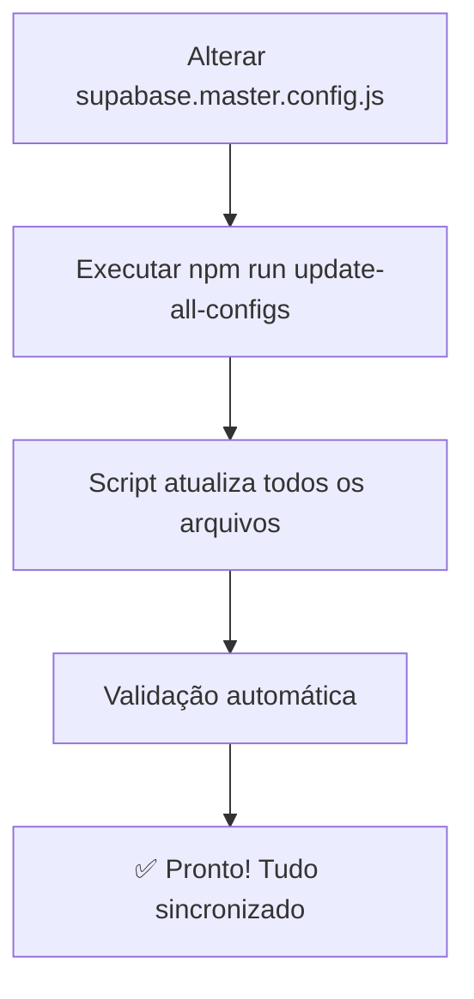

# 🔑 Configuração Única do Supabase

## 🎯 **LUGAR PADRÃO ÚNICO - NUNCA MAIS ALTERE EM 4 LUGARES!**

### 📍 **Para alterar URL ou API Key do Supabase:**

1. **Edite APENAS este arquivo:** `supabase.master.config.js`
2. **Execute:** `npm run update-all-configs`
3. **Pronto!** Todos os arquivos são atualizados automaticamente ✨

## 🏗️ **Arquitetura da Solução**

```
📁 Configuração Master (ÚNICA FONTE DA VERDADE)
└── supabase.master.config.js  ← ALTERE APENAS AQUI!

📁 Arquivos Sincronizados Automaticamente:
├── .env.example               ← Atualizado automaticamente
├── app.json                   ← Atualizado automaticamente  
├── src/config/supabase-secure.ts ← Atualizado automaticamente
├── analyze-schema.js          ← Atualizado automaticamente
└── todos os scripts de teste  ← Atualizados automaticamente
```

## ⚡ **Como Usar**

### ✅ Para alterar configuração:
```bash
# 1. Edite: supabase.master.config.js
# 2. Execute:
npm run update-all-configs

# OU
npm run config:sync
```

### ✅ Para validar configuração:
```bash
npm run config:validate
```

### ✅ Para novos scripts que precisam de configuração:
```javascript
// ❌ NUNCA FAÇA ISSO:
const supabaseUrl = 'https://hardcoded...';

// ✅ SEMPRE FAÇA ISSO:
const { SUPABASE_MASTER_CONFIG } = require('./supabase.master.config.js');
const supabaseUrl = SUPABASE_MASTER_CONFIG.URL;
```

## 🛡️ **Vantagens da Arquitetura**

### ✅ **Antes** (Problemático):
- ❌ 4+ arquivos para alterar manualmente
- ❌ Risco de inconsistência  
- ❌ Erro humano ao atualizar
- ❌ Configurações espalhadas

### ✅ **Agora** (Solução Definitiva):
- ✅ **1 arquivo** para alterar (`supabase.master.config.js`)
- ✅ **Sincronização automática** de todos os outros
- ✅ **Zero risco** de inconsistência
- ✅ **Validação automática** das configurações

## 📊 **Status Atual**

| Arquivo | Status | Fonte |
|---------|--------|-------|
| `supabase.master.config.js` | 🔧 **MASTER** | Manual |
| `.env.example` | ✅ Sincronizado | Auto |
| `app.json` | ✅ Sincronizado | Auto |
| `src/config/supabase-secure.ts` | ✅ Sincronizado | Auto |
| `analyze-schema.js` | ✅ Sincronizado | Auto |
| Scripts de teste | ✅ Sincronizados | Auto |

## 🔄 **Fluxo de Trabalho**



## 🚨 **Regras Importantes**

### ✅ **PODE:**
- Editar `supabase.master.config.js`
- Executar `npm run update-all-configs`
- Usar `SUPABASE_MASTER_CONFIG` em novos scripts

### ❌ **NÃO PODE:**
- Editar URLs/chaves diretamente em outros arquivos
- Fazer hardcode de configurações
- Pular a sincronização após alterar o master

## 🎯 **Exemplos de Uso**

### Para Scripts Node.js:
```javascript
const { SUPABASE_MASTER_CONFIG } = require('./supabase.master.config.js');
const url = SUPABASE_MASTER_CONFIG.URL;
const key = SUPABASE_MASTER_CONFIG.ANON_KEY;
```

### Para TypeScript/React:
```typescript
import { SUPABASE_CONFIG } from './src/config/supabase-secure';
// Já usa a configuração master automaticamente!
```

### Para testes automatizados:
```javascript
// O script de sincronização já atualizou todos os arquivos de teste!
```

## 📚 **Documentação Relacionada**

- [`docs/SUPABASE_CONFIG.md`](./docs/SUPABASE_CONFIG.md) - Documentação técnica completa
- [`src/config/supabase-secure.ts`](./src/config/supabase-secure.ts) - Configuração TypeScript segura  
- [`sync-supabase-config.js`](./sync-supabase-config.js) - Script de sincronização

---

## 🎉 **Resultado Final**

**Você nunca mais precisará alterar configuração em 4 lugares diferentes!**

✨ **1 arquivo para alterar + 1 comando para sincronizar = Configuração perfeita!** ✨
