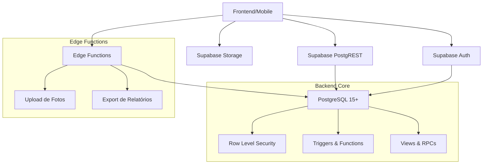

# 🏥 ConectaSaúde

**Sistema Completo de Gestão para Secretaria Municipal de Saúde**

[](https://supabase.com)
[](https://postgresql.org)
[](https://typescriptlang.org)
[](https://nodejs.org)

---

## 📋 Sobre o Projeto

O **ConectaSaúde** é um sistema backend completo desenvolvido especificamente para Secretarias Municipais de Saúde no Brasil. Construído sobre a plataforma Supabase (PostgreSQL + PostgREST + Edge Functions), oferece uma solução robusta, escalável e segura para gestão integral dos recursos de saúde municipal.

### 🎯 Objetivo

Modernizar e digitalizar a gestão de saúde municipal, proporcionando:
- **Controle eficiente** de medicamentos e estoque
- **Gestão completa** de transporte sanitário
- **Cadastro unificado** de munícipes
- **Relatórios gerenciais** em tempo real
- **Segurança robusta** com controle de acesso
- **Conformidade** com padrões brasileiros

---

## ✨ Funcionalidades Principais

### 💊 **Gestão de Medicamentos**
- Cadastro completo com classificação ABC
- Controle de estoque com alertas automáticos
- Rastreamento de lotes e validades
- Movimentações de entrada, saída e transferência
- Relatórios de consumo e necessidades

### 🚑 **Transporte Sanitário**
- Cadastro de veículos com documentação
- Gestão de motoristas e habilitações
- Controle de manutenções e custos
- Agendamento de transporte
- Relatórios operacionais

### 👥 **Gestão de Munícipes**
- Cadastro completo com validação CPF
- Upload seguro de fotos
- Histórico de atendimentos
- Integração com CEP automático
- Controle de privacidade (LGPD)

### 📊 **Relatórios e Analytics**
- Dashboard executivo em tempo real
- Relatórios customizáveis
- Exportação em múltiplos formatos
- Indicadores de performance (KPIs)
- Alertas automáticos

### 🔒 **Segurança e Controle**
- Autenticação robusta (Supabase Auth)
- Controle de acesso por perfis (RLS)
- Auditoria completa de operações
- Backup automático
- Logs detalhados

---

## 🏗️ Arquitetura



### 🧱 **Componentes**

| Componente | Tecnologia | Descrição |
|------------|------------|-----------|
| **Database** | PostgreSQL 15+ | Banco principal com extensões brasileiras |
| **API REST** | PostgREST | API automática com base no schema |
| **Functions** | TypeScript | Serverless functions para lógica complexa |
| **Auth** | Supabase Auth | Sistema completo de autenticação |
| **Storage** | Supabase Storage | Upload seguro de arquivos |
| **Security** | Row Level Security | Controle fino de acesso |

---

## 🚀 Instalação Rápida

### Pré-requisitos

- Node.js 18+ 
- npm 8+ ou yarn
- Conta no [Supabase](https://supabase.com)
- PostgreSQL 15+ (opcional para desenvolvimento local)

### 1. **Clone e Configure**

```bash
# Clone o repositório
git clone https://github.com/seu-usuario/conectasaude.git
cd conectasaude

# Instale dependências
npm install

# Configure ambiente
cp .env.example .env
# Edite o arquivo .env com suas credenciais
```

### 2. **Configure o Supabase**

```bash
# Instale CLI do Supabase
npm install -g supabase@latest

# Faça login
supabase login

# Inicialize projeto
supabase init

# Configure projeto remoto
supabase link --project-ref SEU-PROJECT-ID
```

### 3. **Execute Migrações**

```bash
# Execute todas as migrações
npm run db:migrate

# Deploy das Edge Functions
npm run functions:deploy

# Configure storage
npm run storage:setup
```

### 4. **Verifique Instalação**

```bash
# Teste saúde do sistema
npm run health

# Valide migrações
npm run validate
```

---

## 📚 Documentação Completa

| Documento | Descrição |
|-----------|-----------|
| [📖 Manual do Usuário](docs/MANUAL_USUARIO.md) | Guia completo para usuários finais |
| [🔧 Guia de Deploy](docs/DEPLOY.md) | Instruções de instalação e deploy |
| [🔌 Documentação da API](docs/API.md) | Endpoints e exemplos de uso |
| [🏗️ Arquitetura](docs/ARQUITETURA.md) | Detalhes técnicos e decisões |
| [🔒 Segurança](docs/SEGURANCA.md) | Políticas e boas práticas |
| [📊 Relatórios](docs/RELATORIOS.md) | Guia de relatórios disponíveis |

---

## 🗂️ Estrutura do Projeto

```
conectasaude/
├── 📁 sql/migrations/          # Migrações do banco de dados
│   ├── 001_init.sql           # Schema inicial e validações
│   ├── 002_rls.sql            # Políticas de segurança
│   ├── 003_triggers.sql       # Triggers e automações
│   ├── 004_rpcs.sql           # Funções remotas
│   ├── 005_views.sql          # Views e relatórios
│   └── 006_seeds.sql          # Dados iniciais
├── 📁 functions/               # Edge Functions (TypeScript)
│   ├── upload_municipe_foto/  # Upload de fotos
│   └── relatorios_export/     # Exportação de relatórios
├── 📁 docs/                   # Documentação completa
├── 📁 tests/                  # Testes e validações
├── 📁 scripts/                # Scripts de automação
├── 📁 monitoring/             # Configurações de monitoramento
├── 🐳 docker-compose.yml      # Ambiente de desenvolvimento
├── 🔧 package.json            # Dependências e scripts
└── 📋 README.md               # Este arquivo
```

---

## 🎮 Scripts Disponíveis

### **Desenvolvimento**
```bash
npm run dev              # Inicia ambiente de desenvolvimento
npm run build            # Build da aplicação
npm run test             # Executa testes
npm run lint             # Análise de código
```

### **Banco de Dados**
```bash
npm run db:migrate       # Executa todas as migrações
npm run db:reset         # Reset completo do banco
npm run db:backup        # Backup do banco
npm run db:seed          # Popula dados iniciais
```

### **Edge Functions**
```bash
npm run functions:deploy # Deploy de todas as functions
npm run functions:serve  # Serve functions localmente
npm run functions:logs   # Visualiza logs das functions
```

### **Utilitários**
```bash
npm run setup            # Setup completo do projeto
npm run health           # Verifica saúde do sistema
npm run security:audit   # Auditoria de segurança
npm run docs:generate    # Gera documentação
```

---

## 🔒 Segurança

O ConectaSaúde implementa as melhores práticas de segurança:

- **🔐 Autenticação JWT** com refresh tokens
- **🛡️ Row Level Security (RLS)** em todas as tabelas
- **👥 Controle de acesso** por perfis (Admin/Operador/Consulta)
- **📝 Auditoria completa** de todas as operações
- **🔒 HTTPS obrigatório** em produção
- **🇧🇷 Validações brasileiras** (CPF, CEP, etc.)
- **📋 Conformidade LGPD** para dados pessoais

### Perfis de Usuário

| Perfil | Permissões | Uso Típico |
|--------|------------|------------|
| **Admin** | Acesso total, configurações | Gestor de TI, Secretário |
| **Operador** | CRUD completo, relatórios | Funcionários operacionais |
| **Consulta** | Apenas leitura | Auditores, consultores |

---

## 📊 Relatórios Disponíveis

### **Dashboards**
- 📈 **Executivo**: KPIs principais e métricas
- 💊 **Medicamentos**: Estoque, consumo, alertas
- 🚑 **Transporte**: Utilização, custos, manutenções
- 👥 **Munícipes**: Demografia, atendimentos

### **Relatórios Operacionais**
- 📋 Inventário de medicamentos
- 🚨 Alertas de estoque mínimo
- 📦 Movimentações de estoque
- 🚛 Relatório de transportes
- 💰 Análise de custos
- 📅 Agenda de manutenções

### **Exportações**
- 📄 **CSV** para análise em planilhas
- 📊 **JSON** para integração com sistemas
- 📋 **PDF** para impressão e arquivo

---

## 🚀 Deploy em Produção

### **Supabase Cloud (Recomendado)**
```bash
# Configure projeto
supabase link --project-ref SEU-PROJECT-ID

# Deploy completo
npm run deploy:production
```

### **Docker**
```bash
# Build da imagem
docker build -t conectasaude:latest .

# Execução com Docker Compose
docker-compose -f docker-compose.yml -f docker-compose.prod.yml up -d
```

### **Ambiente Hybrid**
- Database: Supabase Cloud
- Functions: Vercel/Netlify
- Frontend: Qualquer provedor

---

## 🤝 Contribuição

Contribuições são sempre bem-vindas! Por favor:

1. **Fork** o projeto
2. **Crie** uma branch para sua feature (`git checkout -b feature/AmazingFeature`)
3. **Commit** suas mudanças (`git commit -m 'Add some AmazingFeature'`)
4. **Push** para a branch (`git push origin feature/AmazingFeature`)
5. **Abra** um Pull Request

### **Padrões de Código**
- Use **snake_case** para SQL (tabelas, colunas, funções)
- Use **camelCase** para TypeScript/JavaScript
- **Documente** todas as funções públicas
- **Teste** antes de commitar
- **Siga** os padrões ESLint/Prettier

---

## 📞 Suporte

### **Documentação**
- [📖 Wiki Completa](https://github.com/seu-usuario/conectasaude/wiki)
- [❓ FAQ](docs/FAQ.md)
- [🔧 Troubleshooting](docs/TROUBLESHOOTING.md)

### **Comunidade**
- [💬 Discussions](https://github.com/seu-usuario/conectasaude/discussions)
- [🐛 Issues](https://github.com/seu-usuario/conectasaude/issues)
- [📧 Email](mailto:suporte@conectasaude.local)

### **Comercial**
Para licenças comerciais, suporte premium e customizações:
- 📧 **Email**: comercial@conectasaude.local
- 📱 **WhatsApp**: +55 11 9999-9999
- 🌐 **Site**: https://conectasaude.com.br

---

## 📄 Licença

Este projeto está sob a licença MIT. Veja o arquivo [LICENSE](LICENSE) para detalhes.

```
MIT License

Copyright (c) 2025 ConectaSaúde Team

Permission is hereby granted, free of charge, to any person obtaining a copy
of this software and associated documentation files (the "Software"), to deal
in the Software without restriction, including without limitation the rights
to use, copy, modify, merge, publish, distribute, sublicense, and/or sell
copies of the Software, and to permit persons to whom the Software is
furnished to do so, subject to the following conditions:

The above copyright notice and this permission notice shall be included in all
copies or substantial portions of the Software.

THE SOFTWARE IS PROVIDED "AS IS", WITHOUT WARRANTY OF ANY KIND, EXPRESS OR
IMPLIED, INCLUDING BUT NOT LIMITED TO THE WARRANTIES OF MERCHANTABILITY,
FITNESS FOR A PARTICULAR PURPOSE AND NONINFRINGEMENT. IN NO EVENT SHALL THE
AUTHORS OR COPYRIGHT HOLDERS BE LIABLE FOR ANY CLAIM, DAMAGES OR OTHER
LIABILITY, WHETHER IN AN ACTION OF CONTRACT, TORT OR OTHERWISE, ARISING FROM,
OUT OF OR IN CONNECTION WITH THE SOFTWARE OR THE USE OR OTHER DEALINGS IN THE
SOFTWARE.
```

---

## 🏆 Reconhecimentos

- **Supabase Team** pela excelente plataforma
- **PostgreSQL Community** pelo banco robusto
- **Comunidade Open Source** pelas bibliotecas utilizadas
- **Secretarias Municipais** que inspiraram este projeto

---

## 📈 Roadmap

### **v1.1 - Q2 2025**
- [ ] Interface web administrativa
- [ ] App mobile para motoristas
- [ ] Integração com sistemas de pagamento
- [ ] Relatórios avançados com BI

### **v1.2 - Q3 2025**
- [ ] Integração com SUS
- [ ] Módulo de telemedicina
- [ ] API para terceiros
- [ ] Machine Learning para previsões

### **v2.0 - Q4 2025**
- [ ] Multi-tenancy completa
- [ ] Federação de dados
- [ ] Blockchain para auditoria
- [ ] IoT para sensores de estoque

---

<div align="center">

**🏥 ConectaSaúde - Inovando a Saúde Municipal Brasileira**

Made with ❤️ in Brazil 🇧🇷

</div>
