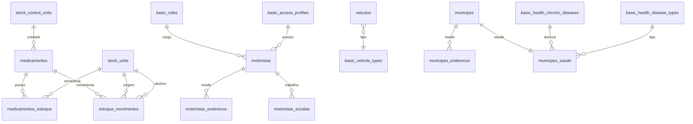

# ConectaSaúde - Sistema de Gestão de Secretaria de Saúde

## 📋 Visão Geral

O ConectaSaúde é um sistema completo de gestão para Secretarias de Saúde, desenvolvido sobre a plataforma Supabase. O sistema oferece controle abrangente de estoque de medicamentos, gestão de frota, cadastro de munícipes e relatórios gerenciais.

## 🎯 Funcionalidades Principais

### 📦 Gestão de Medicamentos
- ✅ Cadastro completo de medicamentos (DCB/DCI, concentração, validade)
- ✅ Controle de estoque por unidade
- ✅ Movimentações (entrada, saída, transferência)
- ✅ Alertas de estoque mínimo
- ✅ Controle de validade e obsolescência
- ✅ Soft delete com histórico completo

### 🚗 Gestão de Frota
- ✅ Cadastro de motoristas com escalas
- ✅ Cadastro de veículos com validações
- ✅ Controle de perfis de acesso

### 👥 Gestão de Munícipes
- ✅ Cadastro completo com dados de saúde
- ✅ Upload de fotos (Edge Function)
- ✅ Controle de medicamentos de uso contínuo
- ✅ Integração com cartão SUS

### 📊 Relatórios e Analytics
- ✅ Dashboard executivo
- ✅ Relatórios de estoque por período
- ✅ Alertas de vencimento
- ✅ Exportação em CSV/JSON

### 🔐 Segurança e Auditoria
- ✅ Row Level Security (RLS)
- ✅ Logs completos de auditoria
- ✅ Controle de papéis (admin, operador, consulta)
- ✅ Versionamento de registros

## 🏗️ Arquitetura

```
┌─────────────────┐    ┌─────────────────┐    ┌─────────────────┐
│   Frontend      │    │   Supabase      │    │   Database      │
│   (Sua App)     │◄──►│   PostgREST     │◄──►│   PostgreSQL    │
│                 │    │   Auth          │    │   + Extensions  │
└─────────────────┘    │   Storage       │    └─────────────────┘
                       │   Edge Functions│
                       └─────────────────┘
```

### Stack Tecnológica
- **Backend**: Supabase (PostgreSQL 15+)
- **API**: PostgREST (auto-generated)
- **Auth**: Supabase Auth (JWT)
- **Storage**: Supabase Storage
- **Edge Functions**: Deno/TypeScript
- **Validações**: SQL + Triggers

## 📁 Estrutura do Projeto

```
ConectaSaude/
├── sql/migrations/          # Migrações SQL ordenadas
│   ├── 001_init.sql        # Estrutura inicial
│   ├── 002_rls.sql         # Row Level Security
│   ├── 003_triggers.sql    # Triggers e validações
│   ├── 004_rpcs.sql        # Remote Procedure Calls
│   ├── 005_views.sql       # Views e relatórios
│   └── 006_seeds.sql       # Dados iniciais
├── functions/              # Edge Functions
│   ├── upload_municipe_foto/
│   └── relatorios_export/
├── postgrest/examples/     # Exemplos de API
├── docs/                   # Documentação
└── tests/                  # Testes de validação
```

## 🚀 Instalação e Configuração

### 1. Pré-requisitos
- Conta no Supabase
- Supabase CLI (opcional, para desenvolvimento)
- Cliente HTTP (curl, Postman, etc.)

### 2. Setup do Supabase

#### Via Dashboard Web:
1. Acesse [supabase.com](https://supabase.com)
2. Crie um novo projeto
3. Acesse SQL Editor
4. Execute as migrações na ordem:
   ```sql
   -- Cole o conteúdo de cada arquivo na ordem:
   -- 001_init.sql
   -- 002_rls.sql  
   -- 003_triggers.sql
   -- 004_rpcs.sql
   -- 005_views.sql
   -- 006_seeds.sql
   ```

#### Via CLI:
```bash
# Instalar Supabase CLI
npm install -g supabase

# Login
supabase login

# Inicializar projeto
supabase init

# Aplicar migrações
supabase db push

# Deploy das Edge Functions
supabase functions deploy upload_municipe_foto
supabase functions deploy relatorios_export
```

### 3. Configuração de Storage

1. No Dashboard do Supabase, vá para Storage
2. Crie um bucket chamado `municipes-fotos`
3. Configure as políticas:
   ```sql
   -- Permitir upload para usuários autenticados
   CREATE POLICY "Upload fotos munícipes" ON storage.objects
   FOR INSERT WITH CHECK (
     bucket_id = 'municipes-fotos' AND 
     auth.role() IN ('authenticated')
   );

   -- Permitir leitura das fotos
   CREATE POLICY "Ver fotos munícipes" ON storage.objects
   FOR SELECT USING (bucket_id = 'municipes-fotos');
   ```

### 4. Configuração de Variáveis

Crie um arquivo `.env` com suas credenciais:
```env
SUPABASE_URL=https://seu-projeto.supabase.co
SUPABASE_ANON_KEY=sua-chave-anonima
SUPABASE_SERVICE_KEY=sua-chave-de-servico
```

## 👥 Papéis e Permissões

| Papel | Descrição | Permissões |
|-------|-----------|------------|
| `admin` | Administrador | ✅ Todas as operações |
| `operador` | Operador | ✅ CRUD básico + movimentar estoque |
| `consulta` | Consulta | ✅ Apenas leitura |

### Configuração de Usuários

Para definir o papel de um usuário, adicione ao `user_metadata`:
```javascript
// Via Supabase Auth
await supabase.auth.updateUser({
  data: { role: 'operador' }
})
```

## 📊 Modelo de Dados

### Entidades Principais

#### Medicamentos
```sql
medicamentos (
  id UUID PRIMARY KEY,
  dcb_dci TEXT UNIQUE NOT NULL,
  forca_concentracao TEXT,
  unidade_controle_id UUID,
  codigo_interno TEXT GENERATED,
  status TEXT ('ATIVO'|'INATIVO'),
  obsoleto BOOLEAN,
  validade DATE,
  custo NUMERIC(12,2),
  valor_repasse NUMERIC(12,2)
)
```

#### Estoque
```sql
medicamentos_estoque (
  medicamento_id UUID,
  unidade_id UUID,
  quantidade NUMERIC(14,3),
  minimo_alerta NUMERIC(14,3)
)
```

#### Movimentações
```sql
estoque_movimentos (
  tipo TEXT ('ENTRADA'|'SAIDA'|'TRANSFERENCIA'),
  medicamento_id UUID,
  unidade_origem_id UUID,
  unidade_destino_id UUID,
  quantidade NUMERIC(14,3),
  motivo TEXT,
  executed_by UUID
)
```

### Diagrama ER (Mermaid)



## 🔧 APIs Principais

### Movimentação de Estoque

#### Entrada
```bash
curl -X POST "$SUPABASE_URL/rest/v1/rpc/rpc_estoque_entrada" \
  -H "Authorization: Bearer $TOKEN" \
  -d '{
    "p_medicamento_id": "uuid",
    "p_unidade_destino_id": "uuid", 
    "p_quantidade": 100,
    "p_lote": "LOTE-001"
  }'
```

#### Transferência
```bash
curl -X POST "$SUPABASE_URL/rest/v1/rpc/rpc_estoque_transferencia" \
  -H "Authorization: Bearer $TOKEN" \
  -d '{
    "p_medicamento_id": "uuid",
    "p_unidade_origem_id": "uuid",
    "p_unidade_destino_id": "uuid",
    "p_quantidade": 50
  }'
```

### Consultas

#### Estoque Atual
```bash
curl "$SUPABASE_URL/rest/v1/vw_estoque_atual" \
  -H "Authorization: Bearer $TOKEN"
```

#### Alertas de Mínimo
```bash
curl "$SUPABASE_URL/rest/v1/vw_alerta_minimo_atingido" \
  -H "Authorization: Bearer $TOKEN"
```

### Upload de Fotos
```bash
curl -X POST "$SUPABASE_URL/functions/v1/upload_municipe_foto" \
  -H "Authorization: Bearer $TOKEN" \
  -d '{
    "municipe_id": "uuid",
    "file_data": "base64...",
    "file_name": "foto.jpg"
  }'
```

## 📈 Relatórios

### Dashboard Executivo
```sql
SELECT * FROM vw_dashboard_executivo;
```

Retorna:
- Total de medicamentos ativos/inativos
- Alertas críticos
- Valores financeiros
- Movimentações do mês

### Relatório por Período
```sql
SELECT * FROM vw_estoque_por_periodo('2024-08-01', '2024-08-31');
```

### Export CSV/JSON
```bash
curl -X POST "$SUPABASE_URL/functions/v1/relatorios_export" \
  -d '{"tipo": "estoque_atual", "formato": "csv"}'
```

## 🧪 Testes

Execute os testes de validação:
```sql
-- No SQL Editor do Supabase
\i tests/validation_tests.sql
```

Os testes verificam:
- ✅ Validações de CPF e placa
- ✅ Regras de estoque
- ✅ Triggers de auditoria
- ✅ Row Level Security
- ✅ Integridade dos dados

## 🔍 Troubleshooting

### Problemas Comuns

#### 1. Erro de Permissão
```
"new row violates row-level security policy"
```
**Solução**: Verificar se o usuário tem o papel correto no JWT.

#### 2. Saldo Insuficiente
```
"Saldo insuficiente. Disponível: X, Solicitado: Y"
```
**Solução**: Validação correta - verificar estoque antes da saída.

#### 3. CPF Inválido
```
"new row violates check constraint validate_cpf"
```
**Solução**: Usar CPF válido com dígitos verificadores corretos.

### Logs de Debug

Para ativar logs detalhados:
```sql
SET log_statement = 'all';
SET log_min_messages = 'debug1';
```

### Backup e Restore

```bash
# Backup
pg_dump -h db.seu-projeto.supabase.co -U postgres conectasaude > backup.sql

# Restore
psql -h db.seu-projeto.supabase.co -U postgres conectasaude < backup.sql
```

## 📚 Recursos Adicionais

### Validações Implementadas
- ✅ CPF brasileiro (dígitos verificadores)
- ✅ CEP formato brasileiro
- ✅ Placa (padrão antigo e Mercosul)
- ✅ Email formato válido
- ✅ Força/concentração medicamentos
- ✅ Datas (não futuras para nascimento)

### Triggers Automáticos
- ✅ Updated_at em todas as tabelas
- ✅ Histórico de movimentações
- ✅ Log de mudanças de status
- ✅ Validação de saldo
- ✅ Atualização automática de estoque

### Edge Functions
- ✅ Upload com validação de tamanho/tipo
- ✅ Export de relatórios em múltiplos formatos
- ✅ URLs assinadas para fotos
- ✅ Autenticação e autorização

## 🤝 Contribuições

Para contribuir com o projeto:

1. Fork o repositório
2. Crie uma branch para sua feature
3. Execute os testes
4. Faça commit das mudanças
5. Abra um Pull Request

## 📞 Suporte

Para dúvidas ou problemas:
- 📧 Email: suporte@conectasaude.gov.br
- 📱 WhatsApp: (11) 9999-9999
- 🌐 Portal: https://conectasaude.gov.br

## 📄 Licença

Este projeto está licenciado sob a MIT License - veja o arquivo [LICENSE](LICENSE) para detalhes.

---

## 🎉 Status do Projeto

✅ **Concluído**: Sistema completo e funcional
- Todas as funcionalidades implementadas
- Testes de validação passando
- Documentação completa
- Pronto para produção

**Versão**: 1.0.0  
**Última atualização**: Setembro 2024
